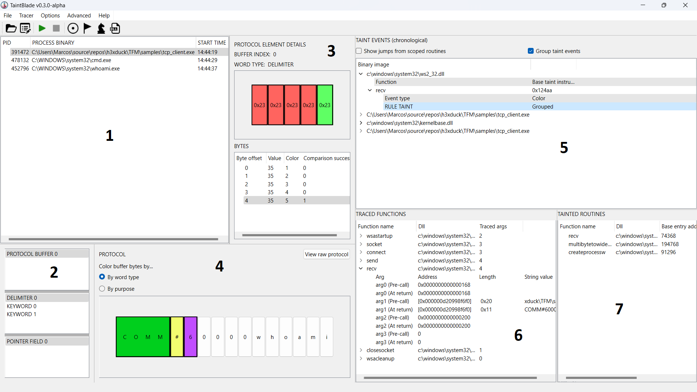
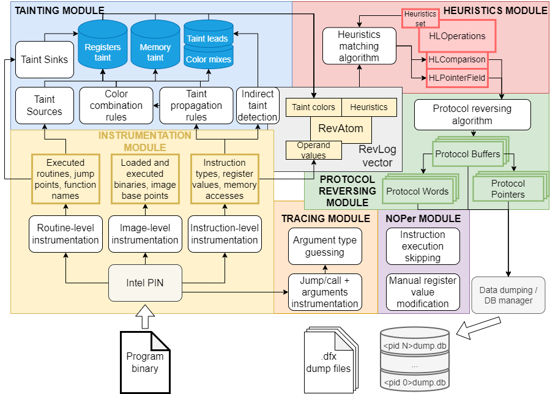

# TaintBlade
⚠️This repository is currently in maintenance.⚠️

We will introduce compilation and usage instructions soon.

For now, you can read the full documentation at my master's thesis [here](https://github.com/h3xduck/TaintBlade/blob/master/docs/document.pdf).

## TaintBlade GUI

## General architecture

